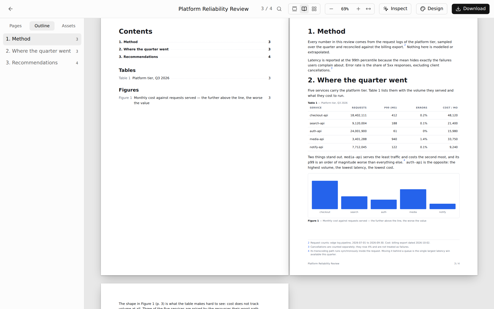
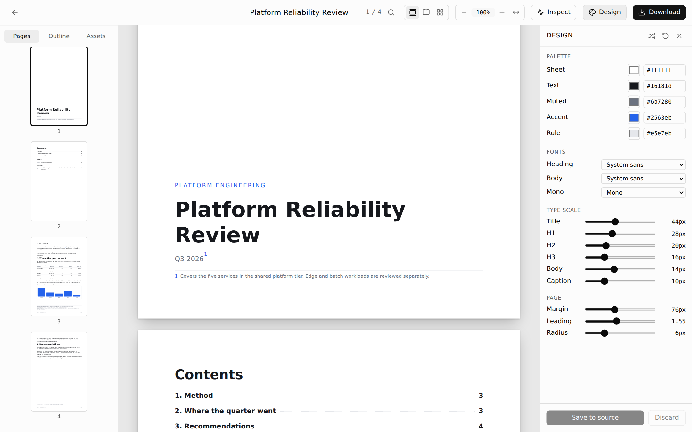

<p align="center">
  
</p>

# MoSage 墨閣

[](https://github.com/nickchen1998/MoSage/actions/workflows/ci.yml)
[](https://www.npmjs.com/package/mosage)
[](LICENSE)

**讓 AI 幫你做出「要印出來、要交出去」的文件。**
報告、企劃書、白皮書、操作手冊、研究成果——用說的描述你要什麼，Claude Code 或 Codex 會把內容寫成頁面；
MoSage 負責把頁面排進真實的紙張、自動分頁、維護目錄與頁碼，最後輸出成 PDF 或可編輯的 Word。

一切都是專案資料夾裡的檔案：不需要帳號，也沒有資料庫，可以直接用 git 管理。

## 三分鐘上手

需要 Node.js 22（22.18 以上）或 24（24.11 以上）。

```bash
npx mosage init my-docs    # 建立專案（預設會安裝相依套件並初始化 git）
cd my-docs
npm run dev                # 瀏覽器打開 http://localhost:5273
```

在同一個資料夾開啟你的 AI 工具（`claude` 或 `codex`），直接描述需要的文件：

> 幫我寫一份給主管看的 Q3 雲端成本檢討，大約 8 頁，數據在 data/costs.csv

AI 會先確認主題、讀者和資料來源——沒有資料就會問你，不會自己編數字——接著規劃頁面、動手撰寫。
你在瀏覽器裡看到的頁面，會隨著檔案變動即時更新。

## 為什麼不直接叫 AI 寫 Word？

AI 擅長寫文字和程式碼，卻很難精準操作 Word 的樣式、分頁和目錄。MoSage 讓 AI 用它最拿手的方式（React 元件）描述每一頁，
版面規則則由框架統一處理。你在瀏覽器裡確認成品，需要 Word 時再一鍵轉出——轉出的是使用 Word 原生樣式的文件，不是貼上去的圖片。

## 功能一覽

### 在瀏覽器裡閱讀、修改、留言

- 左側是頁面縮圖與大綱，中間是實際尺寸的紙張。可以切換**單頁連續**、**雙頁對開**、**格狀總覽**，也能搜尋文字、直接跳到某一頁。
- **Inspect**：點一下頁面上的文字就能直接改，修改會寫回原始檔；也可以留言給 AI，之後對 AI 說「處理留言」（`/apply-comments`），它會逐則處理並清掉留言標記。
- **Design**：即時調整配色、字型、字級、邊界與行距，滿意後寫回文件設定。
- 你正在看的頁面和選取的元素會寫進 `node_modules/.mosage/current.json`，所以可以直接對 AI 說「把這頁的表格改小一點」。

<p align="center">
  
</p>

### 版面交給框架

- **真實紙張**：一律使用 A4，可選直式或橫式。螢幕上的尺寸就是印出來的尺寸。
- **自動分頁**：用 `flow()` 包住連續的內文，框架會實際量測後排進頁面——標題不會孤零零留在頁尾、圖說跟著圖走、表格整張移到下一頁。封面、章節分隔頁則可以用固定頁面自己排。
- **自己維護的目錄與編號**：目錄頁碼、頁首頁尾的頁碼、註腳、圖表編號與交互參照都由框架計算。中間插入一張圖，後面的編號會自動更新。
- **資料驅動的表格與圖表**：`DataTable` 直接讀取 CSV／TSV 檔；`Chart` 畫長條圖、折線圖、圓餅圖，顏色跟著文件配色、自動編號成「圖 N」，PDF 裡是向量圖，Word 裡是圖片。更新資料檔，報告就跟著更新。
- **引用文獻**：`<Cite>` 與 `<Bibliography>` 產生 `[1]` 或（陳大文，2024）這類引用與 APA 格式的參考文獻，可以直接匯入 Zotero、EndNote 匯出的 `.bib` 檔；引用了不存在的文獻，`mosage check` 會回報。
- **偶數字級**：字級一律以 12、14、16… 這樣的偶數 px 為級距，Design 面板每次調整 2px，AI 也照這個規則寫（除非你指定其他字級）。
- **浮水印**：在 `meta` 加上 `watermark: '草稿'`，每一頁都會印上淡淡的斜字；匯出 Word 時是 Word 原生的浮水印，可以在 Word 裡修改或移除。

### 素材：圖片與參考文獻

- **圖片**統一放在 `assets/images/`，在素材頁與文件左側的 Assets 分頁瀏覽。圖片改名時，文件裡的 import 會自動跟著更新。
- **參考文獻**：圖片以外的檔案（PDF、Word、試算表、文字、音訊、影片…）都放在 `assets/references/`，PDF、文字、CSV／TSV、音訊與影片可以直接預覽。AI 撰寫前會先讀這裡的資料，數字與引文以此為準。
- 上傳的檔案一律複製進專案資料夾，跟著專案一起用 git 管理。

### AI 生圖

在 **Settings → AI images** 選擇生圖方式，每份文件也可以各自決定要不要使用：

| 方式 | 做法 |
| --- | --- |
| 預留 prompt 給 Codex | 撰寫時 AI 會在需要圖片的地方放一個 `<ImagePrompt>`（含 prompt 與版面尺寸）。之後在專案裡開啟 Codex，請它「產生圖片」（`generate-images` skill），用你的 Codex 訂閱畫圖並放回頁面 |
| OpenAI API | 在設定頁輸入 `OPENAI_API_KEY`（只存在本機的 `~/.mosage/credentials.json`，不會進 git），直接在文件的 Assets 分頁按 **Generate**。每次生圖都會記錄 input／output token 與預估花費（USD） |

生成的圖片會存進 `assets/images/`，並自動換掉原本的 `<ImagePrompt>`。

### 設定

**Settings** 頁可以切換介面語言（English／繁體中文，預設跟隨瀏覽器）、調整介面文字大小、設定 AI 生圖，並顯示目前版本。語言與文字大小都只影響操作介面，頁面內容與匯出不會改變。

### 交件前先檢查

`mosage check` 會以實際尺寸渲染每一頁，列出超出紙張的內容、空白頁、落在頁尾的標題、太小的字、讀不到的圖片、找不到對象的交互參照，並附上原始碼的行號；
發現錯誤時以非零狀態結束，可以直接放進 CI。
同時也會檢查中文排版：中文旁邊的半形標點、中文用了英文引號（應該用「」）、同一份文件裡「台」「臺」混用，這些列為提醒，不影響結束狀態。

### 匯出

| 格式 | 適合的情境 |
| --- | --- |
| PDF | 最終成品，版面與瀏覽器看到的完全一致；`mosage export` 匯出的 PDF 附有章節書籤 |
| Word（.docx） | 要在 Word 裡審閱或交給別人修改：標題、清單、表格、註腳、目錄、頁首頁尾都轉成 Word 原生格式 |

在瀏覽器右上角的 **Download** 選單匯出，或用指令 `mosage export <文件> --format docx`（指令匯出需要另外安裝 `playwright`）。

### 其他

- 主題（themes）管理，文件可以用資料夾分類。`mosage init` 建立的專案內建函文、會議紀錄、橫式信封、直式信封四個主題。
- `mosage import 報告.docx`（或 `notes.md`）：把既有的 Word 檔或 Markdown 轉成一份文件——標題、粗斜體、清單、表格、圖片、註腳與連結都會保留，Word 的圖表、文字方塊與方程式則會列出來請你重做。
- `mosage build`：輸出靜態網站，可以直接部署。
- **自動檢查更新**：`npm run dev` 啟動時會檢查 npm 上有沒有新版；有的話，在終端機輸入 `u` 再按 Enter 就會更新並重新啟動（也可以執行 `npx mosage upgrade`）。

## 內建的 AI skills

`mosage init` 會把以下 skills 裝進專案的 `.agents/skills`（Codex 等工具）與 `.claude/skills`（Claude Code）：

| Skill | 什麼時候用 |
| --- | --- |
| `create-doc` | 從零開始做一份文件：先釐清主題、讀者與資料來源，再規劃頁面、撰寫 |
| `doc-authoring` | 撰寫與修改頁面時的技術規範：紙張尺寸、字級、分頁、表格、圖片 |
| `current-doc` | 解讀「這一頁」「這個元素」——你在瀏覽器裡正在看的位置 |
| `apply-comments` | 處理你在 Inspect 模式留給 AI 的留言 |
| `create-theme` | 建立可重複使用的主題（配色、字型、元件樣式） |
| `generate-images` | 把文件裡的 `<ImagePrompt>` 畫成圖片並放回頁面（給 Codex 用；OpenAI API 模式也適用） |

`mosage upgrade` 會一併更新 skills；手動更新可以執行 `npx mosage sync:skills`。

## 指令

| 指令 | 說明 |
| --- | --- |
| `npx mosage init [資料夾]` | 建立新專案（可加 `--no-install`、`--no-git`、`--use-pnpm` 等選項） |
| `mosage dev` | 開啟開發伺服器與檢視器 |
| `mosage check [文件…]` | 檢查版面問題 |
| `mosage export [文件…]` | 匯出 PDF 或 Word（`--format pdf\|docx`、`--all`、`--out-dir`） |
| `mosage import <檔案.docx｜檔案.md>` | 把 Word 檔或 Markdown 轉成文件 |
| `mosage images` | 列出等待生成的 `<ImagePrompt>`（`--json` 給 AI 讀） |
| `mosage images generate` | 用 OpenAI API 生成圖片（`--doc`、`--id`） |
| `mosage images place <文件> [id]` | 把已存好的圖片換進頁面（Codex 畫完圖後使用） |
| `mosage upgrade` | 更新到最新版，並同步 React、Vite 版本與 skills |
| `mosage build` / `mosage preview` | 輸出與預覽靜態網站 |
| `mosage sync:skills` | 更新專案裡的 AI skills |

## 一份文件長什麼樣子

每份文件是 `docs/<代號>/index.tsx`，預設匯出一個頁面陣列：

```tsx
import { type DocEntry, type DocMeta, flow, TableOfContents } from 'mosage';

const Cover = () => (
  <section style={{ padding: 96 }}>
    <h1>Q3 雲端成本檢討</h1>
    <p>基礎架構組 · 2026 年 10 月</p>
  </section>
);

const Contents = () => <TableOfContents />;

export const meta: DocMeta = { title: 'Q3 雲端成本檢討', pageSize: 'A4' };

export default [
  Cover,
  Contents,
  flow(
    <>
      <h2>摘要</h2>
      <p>本季雲端支出較上季成長 8%，主要來自……</p>
    </>,
  ),
] satisfies DocEntry[];
```

固定頁面（封面、目錄）是一個元件對應一張紙；`flow()` 裡的內容則交給框架分頁。

## 參與開發

```bash
pnpm install
pnpm dev          # 用本機的 mosage 執行 apps/demo
pnpm build
pnpm typecheck
pnpm check        # Biome
pnpm test         # Vitest
pnpm test:e2e     # Playwright
```

| 路徑 | 內容 |
| --- | --- |
| [packages/core](packages/core) | `mosage` 套件：檢視器、Vite 外掛、CLI、專案範本、AI skills |
| [apps/demo](apps/demo) | 開發用的範例專案 |

發佈流程與貢獻方式請見 [CONTRIBUTING.md](CONTRIBUTING.md)。

## 致謝

MoSage 以 Simon Liu 的 [open-doc](https://github.com/simonliu-ai-product/open-doc)（MIT 授權）為基礎開發，
open-doc 的架構則源自 Yiwei Ho 的 [open-slide](https://github.com/open-slide/open-slide)。
MoSage 在此基礎上加入 Word 匯出與多頁檢視模式，整合為單一套件，並獨立維護。

## 授權

[MIT](LICENSE)
